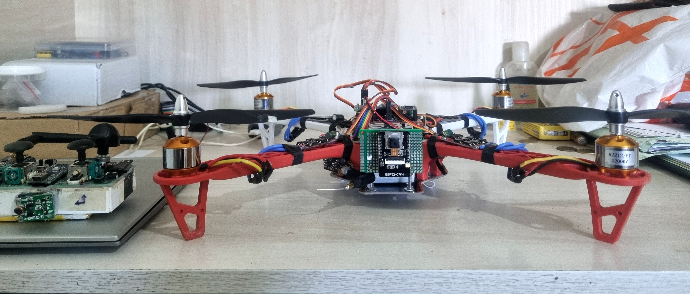
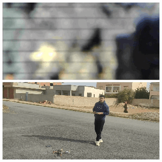
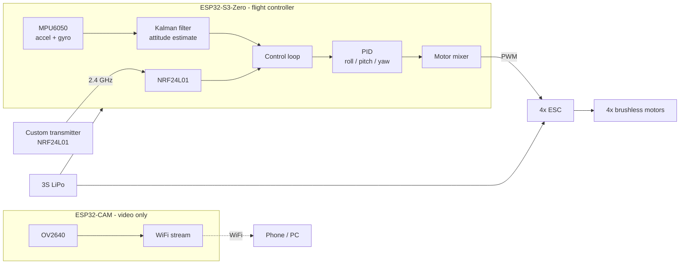
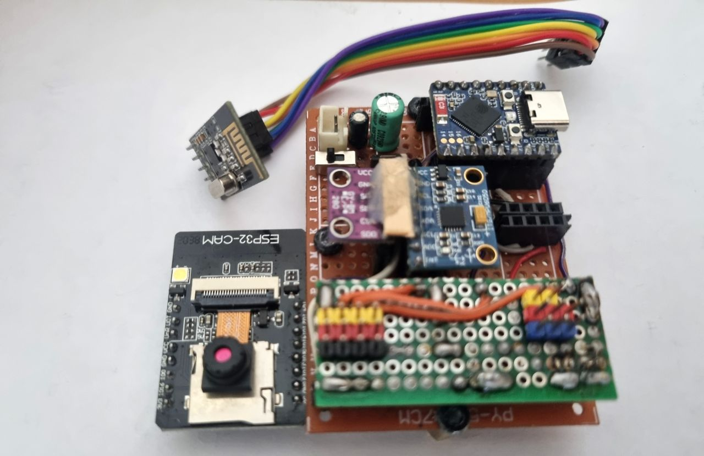
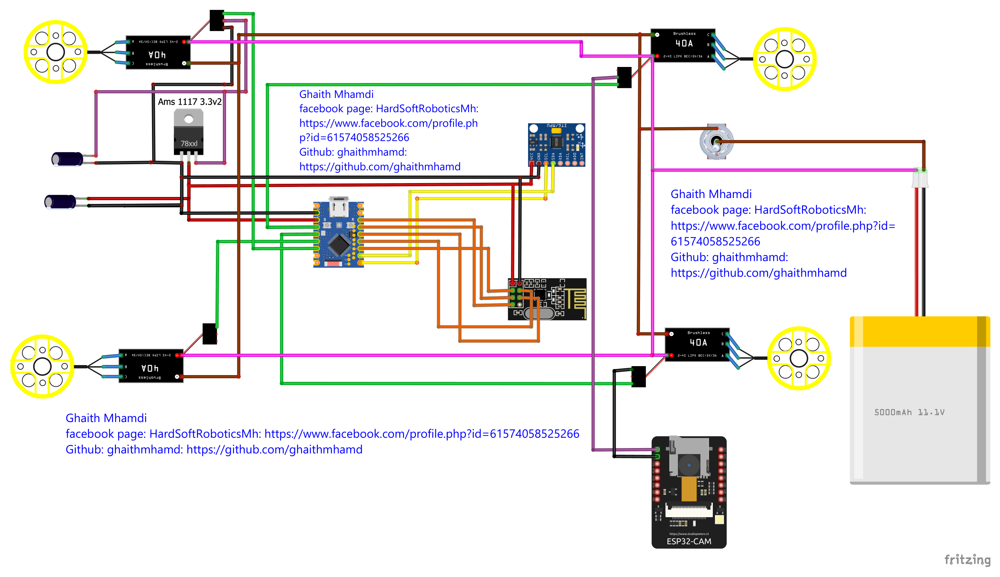

<div align="center">



# 🚁 ESP32 Drone — Stabilize Mode with ESP32-CAM

**A DIY quadcopter flown by an ESP32-S3-Zero, with Kalman-filtered attitude estimation, PID stabilization, NRF24L01 radio control and live FPV video from an ESP32-CAM.**


</div>

---

## 📖 Overview

This project is a complete quadcopter built from low-cost parts and written from scratch. The **ESP32-S3-Zero is the flight controller**: it reads the IMU, estimates the drone's attitude, runs the PID loops and drives the four ESCs. The **ESP32-CAM is a separate module that only streams video** over WiFi, so a camera or WiFi problem can never disturb the flight loop.

Original use case: lightweight aerial surveillance of green areas (for example forest monitoring).

---

## 🎬 Flight Demo

Left: the pilot's view of the flight. Right: the live view from the drone's ESP32-CAM.

<!-- media/flight_demo.gif -->
<p align="center"></p>

| | |
|---|---|
| 🎥 Full flight test | [Facebook video](https://www.facebook.com/share/p/1HFidd3Syk/) |
| 📷 ESP32-CAM preview | [YouTube video](https://youtu.be/JYchUapoqzc?si=Sv1O5FwJmP0YOA6_) |

---

## ✨ Features

- ✅ **PID stabilization** (Stabilize mode) on roll, pitch and yaw
- ✅ **Kalman filter** fusing MPU6050 accelerometer and gyroscope data
- ✅ **NRF24L01 radio link** to a custom transmitter
- ✅ **Live FPV video** from an ESP32-CAM over WiFi
- ✅ **Compact 3S LiPo** powered build
- 🚧 Vertical velocity fusion (accelerometer Z + BMP280): not implemented yet

---

## 🏗️ System Architecture



The control loop runs: **read IMU → Kalman filter → compare with the pilot's setpoint → PID → motor mixing → ESC output**.

---

## 🛠️ Hardware

<p align="center">
  
  
</p>

| Component | Role |
|---|---|
| **ESP32-S3-Zero** | Main flight controller |
| **ESP32-CAM** | WiFi video streaming (separate from flight control) |
| **MPU6050** | IMU: 3-axis accelerometer + 3-axis gyroscope |
| **NRF24L01** | Wireless link to the transmitter |
| **4× ESC + brushless motors** | Propulsion |
| **3S LiPo battery** | Power supply |
| **Custom transmitter** | [Radio-transmitter-and-reciever](https://github.com/ghaithmhamd/Radio-transmitter-and-reciever) |

### Schematic

<p align="center"></p>

[📄 Full schematic (PDF)](Schematics.pdf)

---

## 🚀 Getting Started

### 1. Tools

- [Arduino IDE](https://www.arduino.cc/en/software) with the **ESP32 board package** (Espressif)
- Libraries used by the firmware: <!-- TODO: list exact libraries, e.g. RF24, Wire, ESP32Servo or ESC library, Kalman, esp32cam -->

### 2. Flash the flight controller

1. Clone the repository:
   ```bash
   git clone https://github.com/ghaithmhamd/ESP32-drone-Stabilation-Mode-with_ESP32CAM-V2.0.git
   ```
2. Open the flight-controller sketch in Arduino IDE. <!-- TODO: folder / file name -->
3. Select **ESP32S3 Dev Module** (or the matching S3-Zero board) and the right port, then upload.
4. Flash the **ESP32-CAM** sketch separately. <!-- TODO: folder / file name -->

### 3. Calibrate and test

1. Place the drone on a flat surface and run the **IMU calibration** (gyro offsets, accelerometer level).
2. Pair it with the [transmitter](https://github.com/ghaithmhamd/Radio-transmitter-and-reciever) and check that the control inputs respond correctly.
3. Check the motor direction and the motor mixing **with the propellers removed**.
4. Tune the PID gains (see below), then do the first hovering tests in an open area.

> ⚠️ **Safety:** always remove the propellers when testing on the bench, and keep your distance during the first flights.

---

## 🎛️ Tuning Notes

- Mount the IMU **rigidly and level**. Vibration or tilt shows up as drift.
- Start with **P only**, raise it until the drone oscillates, then back off. Add D to damp oscillations and a small I to remove steady drift.
- PID gains depend on the frame, the motors and the propellers, so expect to retune them for a different build.

---

## 🛣️ Roadmap

- [ ] Vertical velocity fusion (MPU6050 Z-axis + BMP280)
- [ ] GPS and waypoint navigation
- [ ] Telemetry feedback (Bluetooth or WiFi)
- [ ] Mobile app for FPV and control
- [ ] Automatic takeoff and landing

---

## 📚 References & Credits

- [Pratik Phadte](https://www.youtube.com/@pratikphadte)
- [Carbon Aeronautics](https://youtube.com/@carbonaeronautics)

---

## 👤 Author

**Ghaith Mhamdi** — Engineering student, École Polytechnique de Tunisie
Robotics · Embedded Systems · FPGA · Autonomous Systems

[](https://github.com/ghaithmhamd)
[](https://www.linkedin.com/in/<your-handle>)

---

## 📄 License

Released under the [MIT License](LICENSE).
